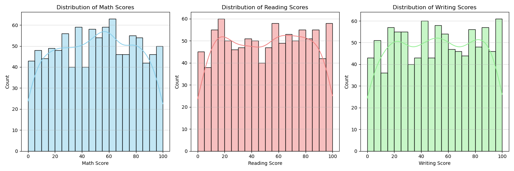
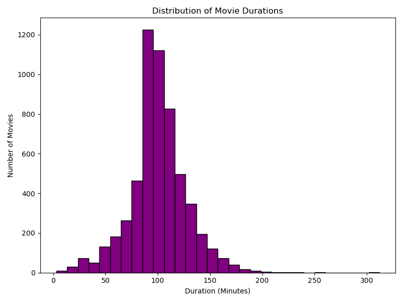
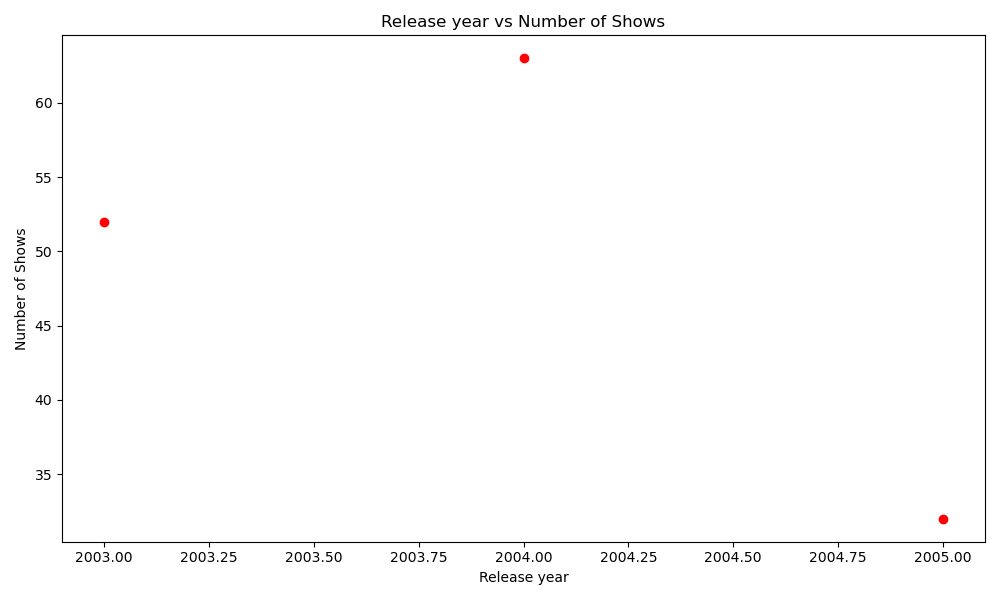
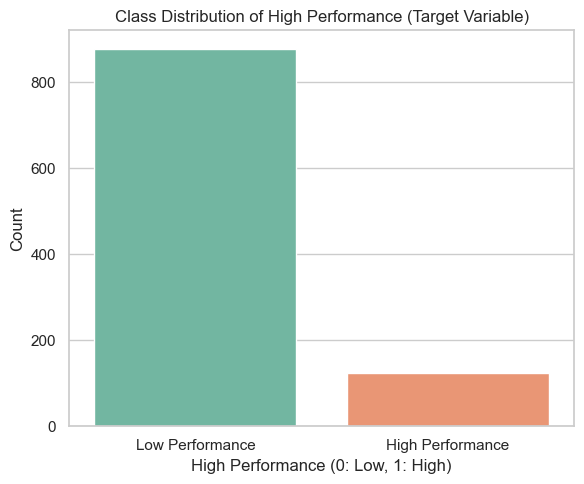
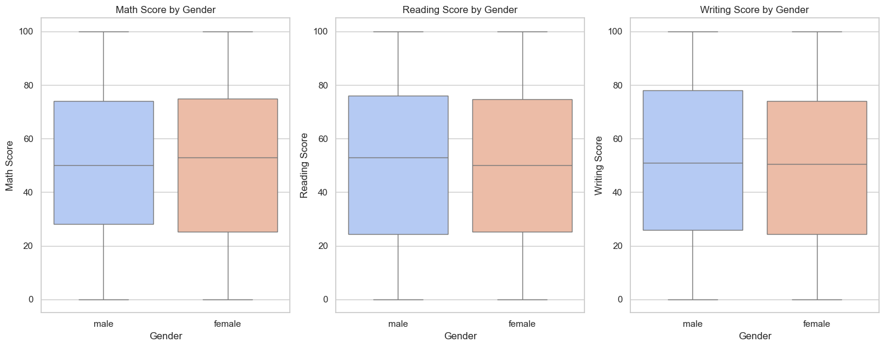
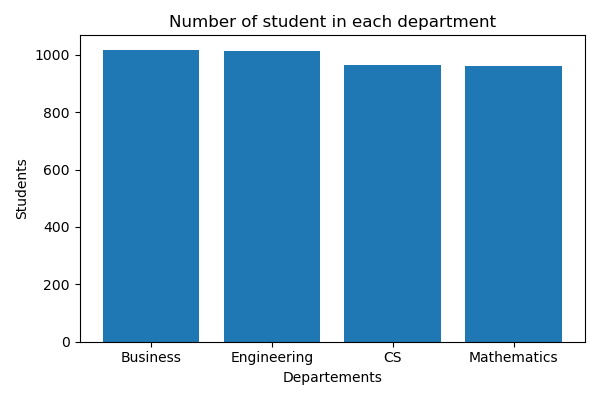

<div align="center">

# 🚀 Python to AI

### *My Journey from Python Fundamentals to Artificial Intelligence*

<p align="center">
A collection of Python notes, Data Science projects, Exploratory Data Analysis, Machine Learning models, and everything I learn on my journey toward becoming an AI Engineer.
</p>

<br>


<br>


</div>

---

# 🌱 About This Repository

Welcome to **Python to AI** 👋

This repository documents my continuous learning journey in **Python**, **Data Science**, **Machine Learning**, and **Artificial Intelligence**.

Rather than showcasing only completed work, this repository reflects my growth as a Computer Science student. Every notebook, dataset, visualization, and project represents another milestone in my learning journey.

From writing my first Python programs to building Machine Learning models — and now deploying them as interactive web apps — this repository continues to grow as I explore new technologies and solve real-world problems.

> 🚀 **Learning never stops, and neither does this repository.**

---

# 🚀 My Learning Journey

```text
🐍 Python
      │
      ▼
🏛 Object-Oriented Programming
      │
      ▼
📊 NumPy
      │
      ▼
🐼 Pandas
      │
      ▼
📈 Matplotlib
      │
      ▼
🌊 Seaborn
      │
      ▼
🧹 Data Cleaning
      │
      ▼
📊 Exploratory Data Analysis
      │
      ▼
⚙ Feature Engineering
      │
      ▼
🎯 Feature Selection
      │
      ▼
🤖 Machine Learning
      │
      ▼
🌐 Model Deployment (Streamlit)
      │
      ▼
🧠 Deep Learning (Coming Soon)
      │
      ▼
🚀 Artificial Intelligence
```

---

# 📚 Repository Contents

## 🐍 Python

- Python Revision
- Variables
- Loops
- Functions
- File Handling
- Exception Handling
- Modules
- Practice Programs

---

## 🏛 Python OOP

- Classes & Objects
- Constructors
- Inheritance
- Encapsulation
- Abstraction
- Polymorphism
- Error Handling

---

## 📊 NumPy

- Arrays
- Indexing
- Slicing
- Broadcasting
- Mathematical Operations
- Statistics

---

## 🐼 Pandas

- DataFrames
- Data Cleaning
- Missing Values
- Filtering
- GroupBy
- Merge
- Aggregation

---

## 📈 Matplotlib

- Line Plot
- Scatter Plot
- Histogram
- Pie Chart
- Bar Chart

---

## 🌊 Seaborn

- Heatmaps
- Pair Plot
- Count Plot
- Distribution Plot
- Box Plot
- Correlation Analysis

---

# 🚀 Featured Projects

This repository contains hands-on projects where I apply Python, Data Science, and Machine Learning concepts to real-world datasets.

---

# 💓 Heart Stroke Prediction — Deployed ML App


### 📌 Overview

A complete, **end-to-end, deployed** Machine Learning project that predicts whether a patient is at **high risk** or **low risk** of heart disease from 11 clinical features. Unlike a typical notebook-only project, this one goes all the way to a **live interactive Streamlit web app** backed by a serialized model pipeline.

### 🔄 Machine Learning Pipeline

- ✅ Data Loading (`heart.csv`, 918 records)
- ✅ Exploratory Data Analysis (distributions, boxplots, violin plots, correlation heatmap)
- ✅ Data Cleaning (invalid zero-value imputation in `Cholesterol` & `RestingBP`)
- ✅ Categorical Encoding (One-Hot Encoding via `pd.get_dummies`)
- ✅ Feature Scaling (`StandardScaler`)
- ✅ Train-Test Split
- ✅ Model Training & Comparison (5 algorithms benchmarked)
- ✅ Best Model Selection
- ✅ Model Serialization (`.pkl` — model, scaler, columns)
- ✅ **Interactive Streamlit Web App**
- ✅ Real-time Risk Prediction UI

### 📊 Model Comparison

| Model | Accuracy | F1-Score |
|---|:---:|:---:|
| Logistic Regression | `0.8696` | `0.8846` |
| **KNN (Deployed Model)** | `0.8641` | `0.8815` |
| SVM | `0.8478` | `0.8667` |
| Decision Tree | `0.8098` | `0.8241` |
| Naive Bayes | `0.8478` | `0.8614` |

**K-Nearest Neighbors** was selected as the final deployed model for its strong, consistent performance across both metrics on the scaled feature set.

### 🖥️ Live App Preview

The trained pipeline is wrapped in a **Streamlit** app (`app.py`) where a user enters patient details and instantly receives a color-coded prediction — ✅ **Low Risk** or ⚠️ **High Risk**.

### 🛠 Technologies

`Python` `NumPy` `Pandas` `Matplotlib` `Seaborn` `Scikit-Learn` `Streamlit` `Joblib`

📁 **[View Full Project & README →](./heart-stroke-prediction)**

---

# 🚢 Titanic Survival Prediction


### 📌 Overview

A classic **binary classification** project predicting passenger survival on the Titanic, used as a hands-on comparison ground for multiple classification algorithms — from linear models to distance-based, probabilistic, tree-based, and kernel-based classifiers.

### 🔄 Machine Learning Pipeline

- ✅ Data Loading (Seaborn's built-in `titanic` dataset, 891 records)
- ✅ Data Cleaning (dropped redundant columns: `deck`, `embark_town`, `alive`, `who`, `adult_male`, `class`)
- ✅ Missing Value Handling (`age` → mean imputation, `embarked` → row drop)
- ✅ Categorical Encoding (`LabelEncoder` on `sex` & `embarked`)
- ✅ Feature Scaling (`StandardScaler` for distance-sensitive models)
- ✅ Train-Test Split (80/20)
- ✅ Model Training & Comparison (5 classification algorithms)
- ✅ Evaluation via Accuracy, Confusion Matrix & Classification Report

### 📊 Model Comparison

| Model | Accuracy | F1-Score (weighted) |
|---|:---:|:---:|
| **Logistic Regression** | `0.8034` | `0.80` |
| Support Vector Machine (SVM) | `0.8258` | `0.82` |
| K-Nearest Neighbors (KNN) | `0.7809` | `0.78` |
| Naive Bayes | `0.7753` | `0.78` |
| Decision Tree | `0.7697` | `0.77` |

**Key takeaway:** SVM achieved the highest accuracy on this split, while Logistic Regression offered the best balance of simplicity and performance. This project reinforced an important ML lesson — **distance-based models like KNN require feature scaling**, while Logistic Regression and Naive Bayes are generally more scale-tolerant.

### 🧠 Concepts Practiced

- Supervised Binary Classification
- Label Encoding vs One-Hot Encoding
- Impact of Feature Scaling on distance-based models
- Confusion Matrix & Classification Report interpretation
- Comparative model benchmarking

### 🛠 Technologies

`Python` `NumPy` `Pandas` `Seaborn` `Scikit-Learn`

> 🚀 Deployment (Streamlit app) planned for a future update.

---

# 🚗 Car Price Prediction


### 📌 Overview

A complete end-to-end Machine Learning project that predicts the selling price of Ford cars using **Linear Regression**.

### 🔄 Machine Learning Pipeline

- ✅ Data Collection
- ✅ Data Understanding
- ✅ Data Cleaning
- ✅ Data Preprocessing
- ✅ Exploratory Data Analysis (EDA)
- ✅ Feature Engineering
- ✅ Feature Selection
- ✅ Train-Test Split
- ✅ Linear Regression Model
- ✅ Model Training
- ✅ Model Evaluation
- ✅ R² Score
- ✅ Adjusted R² Score
- ✅ Prediction

### 🛠 Technologies

`Python` `NumPy` `Pandas` `Matplotlib` `Seaborn` `Scikit-Learn`

---

# 🏥 Insurance Cost Prediction


### 📌 Overview

A complete Machine Learning pipeline that predicts insurance charges using **Linear Regression**.

### 🔄 Project Workflow

- ✅ Data Cleaning
- ✅ Data Preprocessing
- ✅ Exploratory Data Analysis
- ✅ Feature Engineering
- ✅ Feature Selection
- ✅ Linear Regression
- ✅ Model Training
- ✅ Model Evaluation
- ✅ Prediction
- ✅ R² Score
- ✅ Adjusted R² Score

### 🛠 Technologies

`Python` `NumPy` `Pandas` `Matplotlib` `Seaborn` `Scikit-Learn`

---

# 📊 Other Data Analysis Projects

Besides Machine Learning projects, this repository includes multiple datasets for practicing **EDA**, **Data Cleaning**, and **Data Visualization**.

| Dataset | Work Done |
|----------|-----------|
| 🎬 Netflix Dataset | Data Cleaning, EDA, Visualization |
| 🎓 Student Dataset | Data Analysis, Statistics, Visualization |
| 🛒 Sales Dataset | Sales Analysis, Charts, Business Insights |
| 📊 Multiple Practice Datasets | Cleaning, Preprocessing, EDA |

These projects helped me strengthen my understanding of:

- 📊 Exploratory Data Analysis
- 📈 Statistical Analysis
- 📉 Data Visualization
- 🧹 Data Cleaning
- 📋 Data Preprocessing

---

# 📸 Visualization Gallery

These are some visualizations generated during my exploratory data analysis.

<p align="center">


</p>

<p align="center">


</p>

<p align="center">


</p>

<p align="center">


</p>

---

# 💻 Skills & Technologies

| Programming | Data Analysis | Machine Learning | Deployment | Tools |
|--------------|--------------|-----------------|------------|------|
| 🐍 Python | 🐼 Pandas | 🤖 Scikit-Learn | 🌐 Streamlit | 📒 Jupyter Notebook |
| 🏛 OOP | 📊 NumPy | 📈 Linear & Logistic Regression | 📦 Joblib (Model Serialization) | 🐙 GitHub |
| 📝 File Handling | 📉 Matplotlib | 🎯 KNN, SVM, Naive Bayes, Decision Tree | | 🌳 Git |
| ⚠ Error Handling | 🌊 Seaborn | 📊 Feature Engineering & Selection | | 💻 VS Code / PyCharm |

---

# 📈 Repository Progress

| Topic | Status |
|--------|--------|
| 🐍 Python | ✅ Completed |
| 🏛 Object-Oriented Programming | ✅ Completed |
| 📊 NumPy | ✅ Completed |
| 🐼 Pandas | ✅ Completed |
| 📈 Matplotlib | ✅ Completed |
| 🌊 Seaborn | ✅ Completed |
| 🧹 Data Cleaning | ✅ Completed |
| 📊 Exploratory Data Analysis | ✅ Completed |
| ⚙ Feature Engineering | ✅ Completed |
| 🎯 Feature Selection | ✅ Completed |
| 🤖 Linear & Logistic Regression | ✅ Completed |
| 📉 Classification Models (KNN, SVM, Naive Bayes, Decision Tree) | ✅ Completed |
| 🌐 Model Deployment (Streamlit) | ✅ Completed — Heart Stroke Prediction |
| 🧠 Deep Learning | 🔜 Coming Soon |
| 🤖 Artificial Intelligence | 🚀 Journey Continues |

---

<div align="center">

## 👤 Author

**Muzammil Ahmed**
🎓 BS CS/IT — Artificial Intelligence Specialization, NED University of Engineering & Technology

<p>
<a href="#"></a>
<a href="https://www.linkedin.com/in/muzammil-ahmed-795527271/"></a>
</p>

⭐ If you found this repository useful, consider giving it a star — it motivates me to keep learning and building!

</div>
